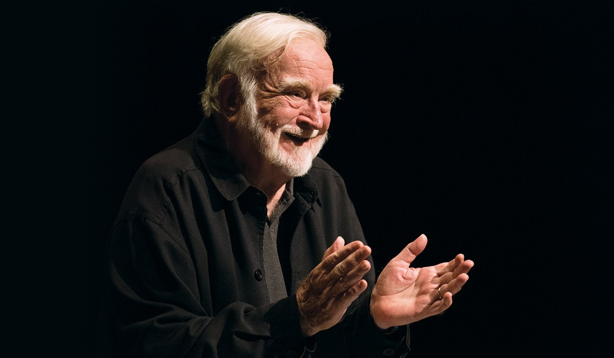
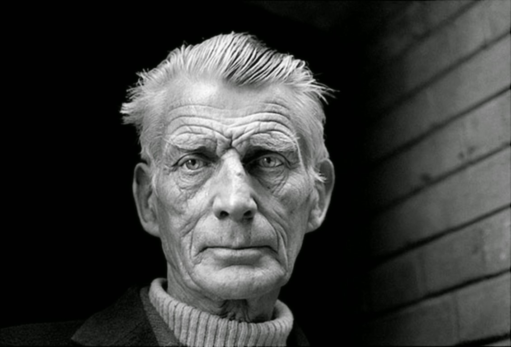

<!-- _class: main -->
# Embracing Failure

j.hobbs@bathspa.ac.uk

---

# Objectives

- Evaluate perceptions of Creativity
- Explore the role of failure within creativity
- Learn how creativity and failure are central to iterative design

---

<!-- _class: lead -->

# 1. Creativity

---

# Activity

 

Go to **https://kleki.com/**

When I say doodle you will have 60 seconds to doodle something on the canvas.

<!--
I want to begin with an activity…
-->

---
<!-- _class: question -->

# Who here is creative?

## Menti: 2259 2242

<!--
Now we’ve finished that activity, let me ask a question. Who here is creative?

Do you consider yourself creative, if so why? If not, why not?

--------------

If you do not feel you are creative then how did you accomplish the last activity? You had the literal task of creating something. You generated an idea that may have been new, novel and surprising. 

In some form it may have had value, firstly value for yourself in terms of contributing to the activity, but also value to others that may have been inspiration, humour or entertainment.
-->

---

---
# We are all creative

- Many of us have got used to being told we are not
- Creativity can be taught and developed
- Creativity is a skill that should be valued & practiced

<!--
Despite what you might feel regarding your level of creativity we are all creative. Yet as noted by Ken Robinson our creativity is drilled out of us by the education system and subsequently the workplace. 

Children are inherently creative, because they have no fear. Without fear kids will take a chance, try things out and have a go.

This freedom to try, this freedom to be Creative is then quashed by an education system that penalises failure. To a degree it feels a little ironic for me to be standing here talking about this when I am part of that education system that will evaluate what you do and make a judgment, which in turn instills this fear of failure. Yet, I’d also like to think that across the degree journey you are on, the modules, their assessments and the marking criteria are designed to enable you to take a chance and try things out as you develop and find your creative voice. 

An environment that allows you to take a chance is important, as otherwise If you are not prepared to be wrong you will never come up with anything original.

Thus whilst many of us may have got used to being told and thinking we are not creative, creativity is in every single one of use. It can be taught and developed. Creativity is a skill that should be valued and practiced. 

-->
---

<!-- _class: question -->

# What is creativity?

## Menti: 2259 2242
<!--
So we've had a discussion about whether we feel creative but what is creativity?
-->

---

# Creativity

 

*“The process of having original ideas that have value”*

**Ken Robinson**

<!--
One simple definition of creativity is one offered by Ken Robinson in his famous TED talk on the education systems effect on creativity. 

Similar definitions are found across different texts. The Cambridge dictionary for example defines creativity as the ability to produce or use original and unusual ideas. Britannica define creativity as the ability to make or otherwise bring into existence something new. These definitions evidence what I was talking about in relation to our earlier doodle activity – you each had the ability to bring into existence something new in the form of your drawings. 

Thus, creativity is the ability to come up with ideas that are new, surprising, useful, progressive and valuable.
-->
---

# What is creativity?

"A process by which a **symbolic domain in culture is changed**…

…creativity results from the interaction of system composed of three elements: a culture that contains symbolic rules, a person who **brings novelty into the symbolic domain**, and a **field of experts who recognise and validate the innovation**"

**Mihaly Cszikszentmihalyi**

<!--
Let's take the definition of creativity a bit further. Mihaly Cszikszentmihalyi states that change must occur from creativity and change stems from the act of creativity offering something novel in the domain that it relates to. 

Yet novelty alone is not enough, that novelty must be validated by a field of experts, who must recognise the novelty and be able to determine its worth.

Such definitions of creativity make it seem difficult to achieve (thus it’s easy to see why some of us may not feel as if we are creative).

-->
---
# What is ideation?

*“Ideation is the process of generating a broad set of ideas on a given topic with no attempt to judge or evaluate them”*

**Nielsen Norman Group**

<!--
Regardless of whether we look at the simpler definitions or those more grander in style, the common trait within these definitions is that creativity involves idea generation. 

Thus creativity is linked to the concept of 'Ideation', which is defined by the Nielsen Norman Group Ideation is the process of generating a broad set of ideas on a given topic with no attempt to judge or evaluate them
-->
---

# What is ideation?

*“Ideation is the process of generating a **broad set of ideas** on a given topic with **no attempt to judge or evaluate them**”*

**Nielsen Norman Group**

<!--
Let’s dig into this definition some more. Note the phrases now highlighted in bold. These emphasise some of the key aspects of ideation

In ideation no idea is a bad idea, the environment should be judgement free. 

The fact that no idea is bad idea is also then emphasised by the fact you are striving for quantity over quality (something that is rarely the case in other contexts). By developing quantity, quality will emerge as ideas get tested and refined towards the right solution.
-->
---

# Worst Possible Idea...

NomNom Foods want to enter the canned soup market. What is the **worst possible idea** you can think of…

 

**Menti: 2259 2242**

<!--
So before we start looking at some of the ideas, why do you think I phrased the activity as what is the “worst possible idea”

Well worst possible idea is an actual ideation technique, based on the premise that it is easier to come up with ideas without the pressure of them needing the be “good”. By requesting the worst ideas we lose all sense of judgement and are therefore more open to sharing our ideas with others. 

You might then think well what’s the point in having lots of bad ideas? Well bad ideas can often be flipped, combined or tweaked to generate a good idea that has value...
-->
---

# Don't Fear Failure

*You tried your best & you failed miserably. The lesson is ‘never try’*

**Homer Simpson**

<!--

Key to Ken Robinson's talk shown earlier is the argument that education systems and even workplaces quash creativity is a fear of failure, which pushes us towards the attitude of the (not) so great philosopher Homer Simpson

If we all took the perspective of Homer nothing would ever get done, we would not improve, we would not innovate and nothing new would come to light.

We saw this in the worst possible idea activity. This activity does the opposite to homer, it purposely invites failure which we then used to develop some reasonable ideas that have potential value in a short period of time.

-->

---

# Be prepared to mae mitakes...

<!--
Therefore, a key point about creativity is being prepared to make mistakes and fundamentally changing how we think about failure. 
-->
---
# Be prepared to make mistakes...

 
 

***The person who never made a mistake, never made anything***

<!--
If we are not prepared to fail we will never make anything. 

We can relate this to the broader process of learning. Take your university experience as an example - University is a process, the work you produce in year one will not be your best work, at this moment you are learning the foundations of your subject alongside the foundations of how to learn in a Higher education setting. This is a key reason why your final degree results is based predominately on your final year grades as by this point you've had the opportunity to learn and build from the mistakes of past work

Therefore at this stage its important to be prepared to make mistakes and know that the work you produce now won't be perfect. However you can learn from these mistakes, take on board the advice and feedback you recieve from peers and tutors and use this to develop and improve going forward. 

-->
---

**Try again,**
**Fail again,**
**Fail better!**

 

**Samuel Beckett**

<!--
This freedom to fail is encompassed by lines from a Samuel Beckett novel which goes:

Ever tried, Ever Failed, No Matter, Try Again, Fail Again, Fail Better. 

Whilst these lines from Beckett’s Westward Ho are slightly taken out of context when isolated from the rest of the novel, they still embody a spirit of freedom that must be instilled within creativity and ideation, yet with an important caveat. 

If you fail, you must try again, but not only that, you must learn from the previous experiences so the next time you can fail better. 
-->
---

# Creativity is a process

- Sometimes things go wrong - Creativity is a process of iteration.
- Try something, evaluate it, refine it, try it again…
- Many of the projects through your degree are as much about the process as it is the product
- It doesn’t matter if the thing you make ‘works’ it’s the journey that’s important

<!--
From this we begin to understand creativity is not an event. Creativity does not happen by magic. The best ideas do not happen instantly.

Whilst the definition of creativity from Cszikentmihalyi we saw earlier alludes to creativity on a grander scale, we do not get their straight away. Take the light bulb for example, Thomas Edison didn't wake up one morning click his fingers and boom lightbulb. Instead there was a long history of ideation, learning, mistakes and people before Edison that drove the ground breaking change. 

Therefore, sometimes (maybe more accurately) things go wrong – Creativity is thus a process of iteration where you try something, you evaluate it, refine it and try it again

As noted earlier many of the project through your degree are as much about the process (fundamentally the process of learning) as it is the product

It doesn’t matter if the thing you make ‘works’ (and often marking criteria account for this), but it’s the journey, how you go there and what you learn from the experience that is important. 
-->
---

<!-- _class: break -->

# Break

---
<!-- _class: lead -->

# 2. Iterative Design Cycle

---

<!--
This idea of creativity being a process links directly to the process of designing experiences and producing effective products for end users. When doing so we should design iteratively which allows us to improve products, learn from feedback and ensures we don’t settle on our first idea. 

The bedrock for designing iteratively and embedded within the design thinking process is the aptly named iterative design cycle. The iterative design cycle has four key phases, observation, ideation, prototyping and testing.
-->
---

# Every phase invites failure

- **Observation:** Discovering what is failing with the current solution, what is the problem we are addressing

- **Ideation:** Invites quantity and encourages bad ideas.

- **Prototyping:** Provides a safe space to fail, prototypes are meant to break as this provides new data to move forward

- **Testing:** You are not seeking praise, but criticism. Failure in testing highlights disconnect between the design intent and user reality

- **Iteration:** Failure drives each cycle of iteration and leads to success

<!--
Every phase of the iterative design cycle invites failure. 

- In the observation stage you are seeking to understand the problem that you are designing a solution for and therefore looking for data to explain why the current solution is failing

- In ideation, as discussed earlier, the intent is the explore quantity rather than quality of ideas. Bad ideas are encouraged rather than dismissed. This allows you to overcome flawed assumptions and develop better insights. The more ideas that fail at this stage the fewer dead ends you chase later. 

- Prototyping offers the safe space to explore ideas through rapid imperfect creation. Prototypes are not meant to be flawless, they are meant to break, they are mean to fail. Failure within prototypes allows you to answer questions and uncover the right direction forward

- When testing prototypes One essential thing to remember is that you are seeking criticism rather than praise. This can make testing uncomfortable as often we don’t want people to highlight the flaws in work. Yet only by encouraging and finding the critique will the design and experience improve. Failed tests allow you to refine and discover where your assumptions or intent don't match with the user

- Each stage of iterative design—sketching offers a unique invitation to fail and drives the cycle of iteration. But in this context, failure is not a setback. It’s feedback. It’s movement. It’s growth. The more fluently a designer can speak the language of failure, the more resilient, insightful, and ultimately successful their designs become.

-->
---
<!-- _class: lead -->

# 3. Case Studies

---
# Infant Baby Warmer

The Embrace infant baby warmer is a low cost incubator designed for use in developing countries where access to traditional incubators is not feasible. 

The product was designed by students at Stanford as part of a design for extreme affordability module.

---

# Infant Baby Warmer

## The Problem
20 million premature or low-weight babies are born each year. In developing countries deaths rates are high due to lack of access to incubators. Students were tasked with creating a low-cost alternative

---

# Infant Baby Warmer

## Observation
By travelling to Nepal to observe the actual users the team observed two key things.
- Majority of babies born in rural areas
- Majority of babies never reached hospital

---

# Infant Baby Warmer

## The Product
After realising the product would need to be transportable, sanitizable and work without electricity the team prototyped a sleeping bag style incubator. 

This was warmed by pouches heated in boiling water and could maintain heat for four hours. 

---

# Infant Baby Warmer

## The Impact
The teams solution costs on $25 dollars compared to $20,000 for a traditional incubator, has won multiple design awards and helped hundreds of thousands of infants survive. 
 
---
# AirBnB

AirBnB has a valuation of over $30 billion, operates in over 81,000 cities and has over 150 million users. But this wasn’t always the case, in 2009 a year into operation the company nearly went bankrupt....

<!--
AirBnB started as a seed of an idea stemming from the observation that all San Francisco hotels were booked up due to a major conference. The founders seeing an opportunity made a simple website offering people to opportunity to stay at their apartment for $80 a night with breakfast. It worked and they got three bookings. Fast forward a few years and the company has grown to include more listings in multiple cities but bookings are low and so is revenue...
-->
---
# AirBnB

## The Problem
In 2009 the company is losing money, fast! With few bookings being made revenue struggled to break $200 per week. 

After analysing listings for places to stay in New York the discovered the problem: 

**Bad Photos**

---
# AirBnB

## Observation

By observing the problem from the perspective of users the founders realised the bad photos meant you couldn’t see what you were going to pay for. 

---

# AirBnB

 

## The solution
Go to New York visit all the listings and take better pictures.

---

# AirBnB

 

## The Impact
Within a week the site double its revenue making $400 dollars instead of $200. A small tweak based on empathy made the difference that continued over the following decade...

---

<!-- _class: question -->

# Can you think of any examples?

## Menti: xxxx-xxxx

<!--
Are there examples of products you can think of that have embraced iterative design and failure as a driver for success

- Apple
- Angry Birds
- The Lightbulb
- Dyson Vaccum Cleaner
- Post-it notes
-->

---
# Takeaways

**Failure is the driver for success**

- To enhance creativity we must embrace failure
- Failure = Feedback
- Prototyping = Permission to fail
- Iterative Design & Design Thinking = Experimentation Framework

---

<!-- _class: main -->

# Thank You

j.hobbs@bathspa.ac.uk

