<!-- _class: main -->

# Ideation & UX Design

##  AI & Creativity 

<!--
Welcome to session 8
-->
---

# Objectives

 

- Look at how creativity is built from creativity
- Question the ethics of copying
- Debate the value of AI in creative practice
- Pilot test a collaborative ed-tech tool named 'Haymay'

<!--
In today's session we will...
-->

---

<!-- _class: lead -->

# 1. Originality vs Copying

---

# Originality

- One of the most prized qualities or features in most definitions of creativity
  - Robinson
  - Csikszentmihalyi
- If originality is good….*copying is bad*?

<!--
Originality is one of the most prized qualities or features in definitions of creativity. Particular definitions that lean towards what's referred to as Big C creativity, the type of creativity that has an impact on society and culture. 

These views can be seen in discussions of Creativity by Ken Robinson and Mihay Csiksentmihalyi which I encourage you to seek out.

Therefore if originality is viewed as good (even the pinnacle of creativity) does that make copying bad?
-->

---

# Copying is bad?

Academic integrity means that a student must ensure that the work they produce for assessment is their own. This concept – based on honesty, fairness, and respect – is a core part of studying in higher education as part of a scholarly community and lays the foundations for future professional life.

Actions that demonstrate academic integrity include:

- Producing work for assessment that is completed solely by you
- Fully acknowledging the authors or sources you quote or reference in your assessments
- Ensuring that the information and / or data you use in your assessments are valid and real
- Complying with any ethical approval requirements related to your assessments
- Complying with the University Assessment Regulations.

<!--
Taken from the university academic misconduct page

If we take the university stance on originality and the need for assessment work to be original, copying is indeed bad and has consequences under the academic misconduct policy.
-->
---

# Is copying always bad?

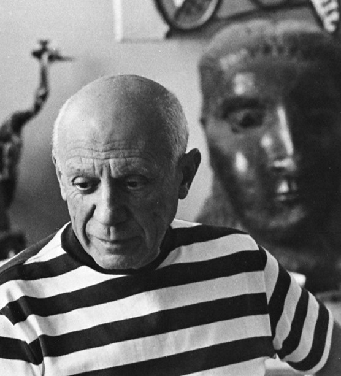

 

*Good artists borrow, great artists steal*

- Pablo Picasso

<!--
Yet is copying always bad? Is there value in copying in a learning context and more broadly in relation to this module is there value to copying within the creative process?
-->

---

<!-- _class: question -->

# What does Picasso mean here?

## Menti: xxxx

<!--
What do we think Picasso means here?

The simple interpretation would be that great artists steal the work of others and pass it off as their own. Yet this is of course not what Picasso means, and Picasso would not be viewed as a great artist if this was all they did. 

“Steal” does not mean “plagarise” nor does it me simply “copy” the work of others, instead the quote is about taking inspiration from the work of others then making it your own.

In discussing this famous quote artist Adam Kurtz explains the difference between copying and stealing. Kurtz argues one is imitation, the other is inspiration. The difference being the intent. Imitation is laziness or refusal to accept influences. Inspiration is recognising influences and turning it into something new. 

The essence of Picasso’s quote is finding inspiration in the work of others then using it as a starting point for original and creative output. Artists recontextualise, remix, substitute or otherwise mashup existing work to create something new. Therefore “stealing” here is going beyond just borrowing something for a weak imitation (which itself just reminds people of the superior original), and instead change it with your own compelling ideas. Once you’ve truly transformed and elevated someone else's idea that idea is now yours, you’ve stolen it. 
-->
---

# Building on the work of others

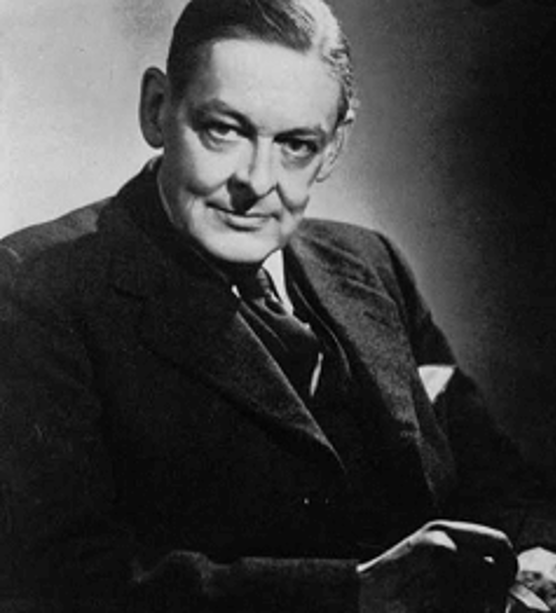

*Immature poets imitate; mature poets steal; bad poets deface what they take, and good poets make it into something better, or at least something different.*

- TS Elliot

<!--
This summary of ‘stealing’ versus ‘plagiarism’ and ‘copying’ and the differences described by Kurtz between imitation and inspiration are evident in this quote from poet TS Elliot
-->
---
<!-- _class: question -->
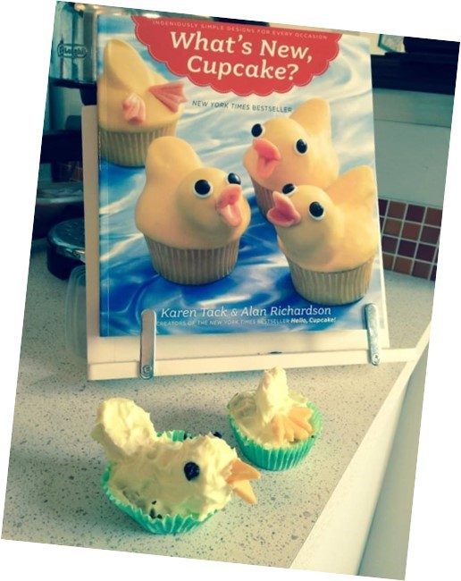

# Is this borrowing or stealing?

## Menti: xxxx

<!--
Based on what we’ve just discussed would this be considered borrowing or stealing

Borrowing – the original is just copied and if anything, it is a poor imitation that serves are a disappointment in comparison to the superior original

-->

---

# Ways of building on the work of others

- Technological
- Generic or stylistic
- Modification / Improvement
- Collaboration
- Recontextualization
- Pastiche
- Parody

<!--

This idea of building on the work of others and taking inspiration from those who have gone before us is one key bedrock of creativity and film, music, games, art and software is replete with instances where one piece of work has taken inspiration from another, with a variety of ways in which creators build on the work of others...

Technological – advancing or adapting an idea with a new technology (Tesla)

Generic or Stylistic – alerting the genre or style of the original (Lion King Example)

Modification or Improvement – enhancing the original with new features or improving the features of the original (X & Threads, Tidal & Spotify)

Collaboration – collaborating with others to take the ideas of each source and create something new (Craft Brewers)

Recontextualization – taking an idea and putting it into a new context (Books adapted into films or tv series, such as Harlan Coben’s numerous mysteries that have been adapted to popular Netflix series).

Pastiche - A pastiche is a creative work that imitates the style of another artist or genre, doing so in a complimentary way. It's like a tribute done by recreating the characteristics of the original work. Yet linked to our discussion on borrowing vs stealing earlier pastiche goes beyond mere imitation. It allows artists to Pay homage Challenge conventions and Create something new. 

Parody - Parody is a form of artistic expression that humorously imitates or exaggerates the style, conventions, or tropes of a specific work, genre, or cultural phenomenon. It often highlights clichés, inconsistencies, or absurdities to create comedic or critical commentary. Parody can be affectionate, paying tribute to its source material, or satirical, using exaggeration to mock or critique. Unlike pastiche, which respectfully imitates and reinterprets a style, parody relies on exaggeration, irony, and humor to transform familiar tropes into something deliberately comedic or absurd. 

-->

---

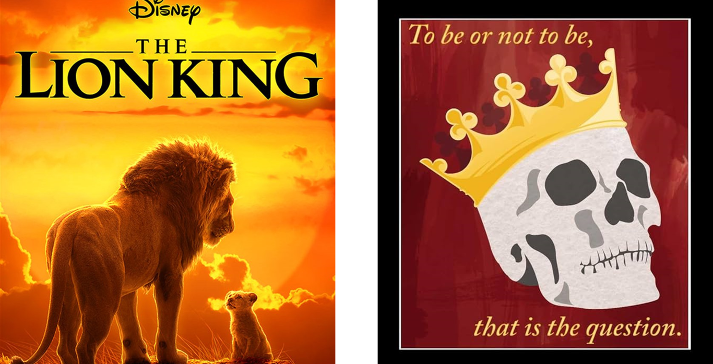

<!--

Lion King & Hamlet (Genre/Stylistic/Recontextualisation)
-->
---
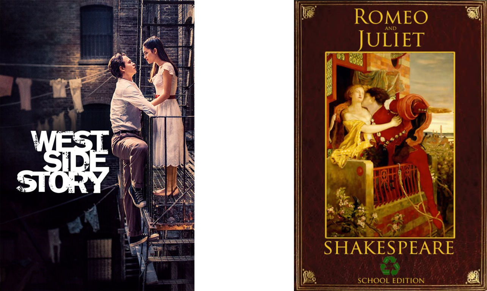

<!--
West Side Story is based on Romeo and Juliet (Recontextulisation)
-->

---
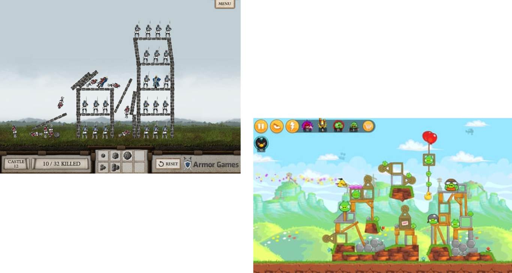

<!--
Angry birds is heavily influenced by Crush the Castle (Technological / Modification & Improvement)
-->

---

<a href="https://www.youtube.com/watch?v=5HDtu8fH59Q" target="_blank">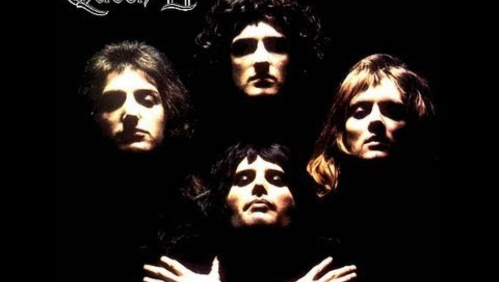</a>

<!--
This iconic song is an example of pastiche. It seamlessly blends operatic sections, hard rock riffs, and a ballad-like interlude, creating a unique and unforgettable musical experience.
-->
---

<a href="https://www.youtube.com/watch?v=i3J6ACKQ7K0" target="_blank">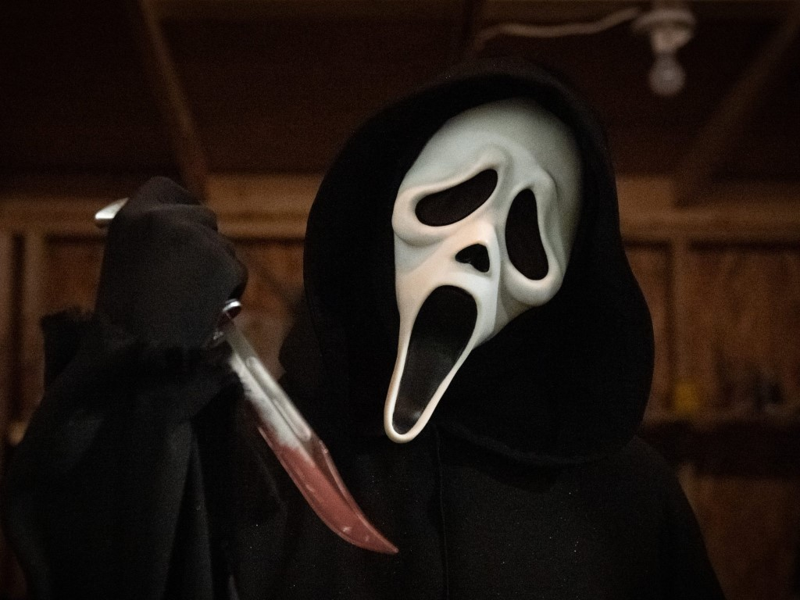</a>

<!--
The Scary Movie franchise is an example of parody, with the films building on cliché’s posed in other scary films and deliberately mocking them in the story line and narrative. 
-->
---

<!-- _class: lead -->

# 2. Creativity & Copyright

---

# Tech, Creativity & Copyright

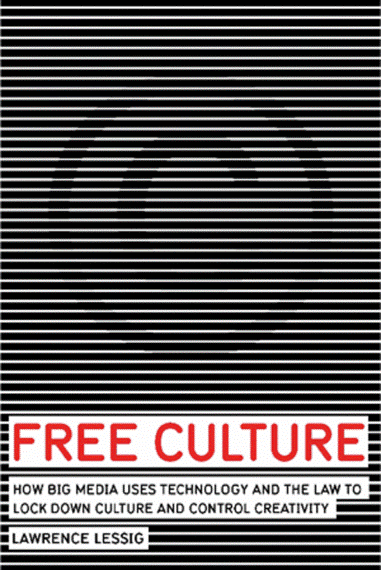

- Free Culture essential for flourishing creative environment
- Threat of legal action discourages creativity
- Internet and ease of access to technology has enabled the rise of a remix culture
- Middle ground required between complete creative anarchy and excessive copyright laws
- Lessig is a founder of Creative Commons

<!--
The ability (or in some instances inability) to build on the work of others feeds into older discourse around tech, creativity and copyright. A key source on this discourse is American scholar Lawrence Lessig and in particular their book “Free Culture”. 

In free culture Lessig compares free culture to free speech and argues just like and open exchange of ideas is crucial for a healthy democracy, unrestricted accession to and creation of culture work is essential for a flourishing creative environment

As such Lessig argues the power influenced by ‘Big Media’ stifles creativity, in particular use of copyright which limits how others can build upon the work of others

In his work Lessig calls for a middle ground complete creative anarchy and excessive control by copyright law. A healthy balance argues Lessig would allow creators to be fairly compensated while enabling remixing, mashups, and other forms of derivative works that can enrich culture. 

The arguments put forward by Lessig are fuelled by how technology and the internet has changed the way culture is created and shared, therefore leading to a need for copyright laws to adapt and foster a more open and collaborative landscape. 

To this end Lessig is one of the founders of creative commons the organisation setup to expand the range of creative works available for others to build upon legally and to share
-->

---

<a href="https://www.youtube.com/watch?v=JXwB9FlkNXA" target="_blank">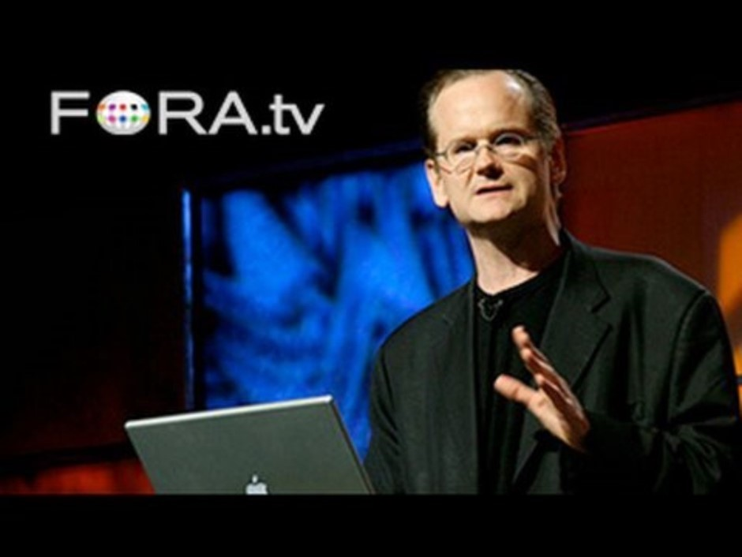</a>

<!--
Here is Lessig himself during a talk on Copyright its potential to hamper creative expression and the inherent creavity in internet remix culture
-->
---

<a href="https://x.com/OneSK_Twt/status/1767873483214573927?s=20" target="_blank">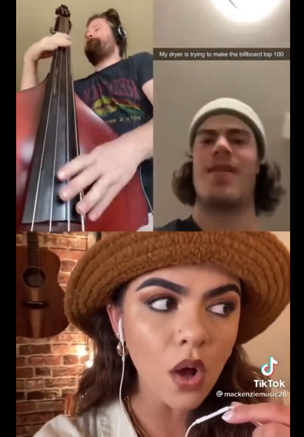</a>

<!--
That video we’ve just seen is 15 years old. Since then more and more platforms have come online which are enabling further emergence of creativity and the burgeoning of remix culture particularly on platforms like TikTok. 

This video in particular which I came across on my nightly doomscroll on twitter emphasises how creativity flourishes on the internet where we have the ability to easily remix and connect with others. It’s a prime example of building on the work of others

https://x.com/OneSK_Twt/status/1767873483214573927?s=20

-->
---

# Making is connecting

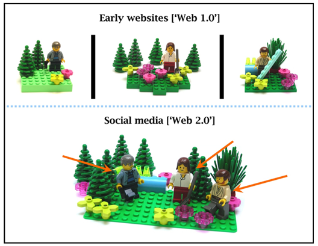

- David Gauntlett
- Social dimension of creativity
- Connecting with the world
- Offline to Online
- Shift from Passive to Active

<!--
The ideas discussed by Lessig, particularly the rise of the remix culture are shared by David Gauntlett in his work “Making is connecting”

Central to making is connecting is the Social Dimension of Creativity: The act of making is rarely done in isolation. We share our creations, discuss them with others, and learn from each other's work. This social dimension is greatly enhanced by the internet and social media and enables connections with the world. Creativity is therefore not just occurring offline, but supercharged by online creativity platforms that allow people to share their creations with a wider audience, fostering connections beyond geographical boundaries.

Altogether this creates a shift from Passive to Active: Gauntlett argues that society is moving away from a "sit-back-and-be-told" culture towards a "making-and-doing" culture. People are increasingly taking charge of their own learning and entertainment by creating their own content.

However, in many instances it is not always the original creator that profits from this shared creativity online.
-->
---

# Rent Seeking

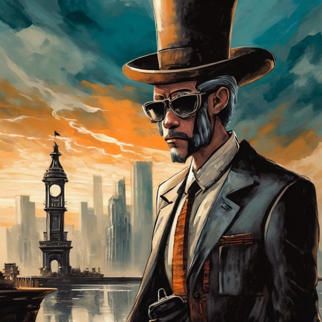

 

The act of growing one’s existing wealth by manipulating the social or political environment without creating new wealth

<!--
The idea of ‘big media’ and the control that a few platforms have on the internet presents links with the rent seeking concept in economics

This concept is present when an individual or entity seeks to increase their own wealth without creating any benefits or wealth to society. Such critiques are beginning to be placed on many of the platforms that control or ‘store’ creative outputs on the internet. Many of these platforms do so without creating any new creative wealth themselves. 

For example, Spotify provides a platform for musicians and artists to share their music and generate massive revenues from doing so yet produce no new music themselves and share negligible amounts of their wealth back to the original creators of the music.
-->

---

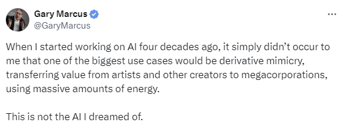

<!--
This issue of rent seeking and exploitation of artist extends into the field of generative AI where tools are harvesting the work of millions of artists without consent and is then used for the profits of a few as well as devaluing the work of the original creator

There are of course counter arguments, we’ve heard some of these already regarding the openness of the internet enabling remix cultures (Lessig) and creative communities to thrive (Gauntlett). Other arguments will highlight the usefulness technology and AI in an ideation process and its ability to democratise creativity.

https://x.com/GaryMarcus/status/1758202932569473034

-->

---
<!-- _class: lead -->

# 3. AI & Creativity

---

<!-- _class: question -->

# Are you pro AI or Anti-AI?

## Menti: xxxx
---

# Haymay - Pilot Test

- Haymay is an ed-tech tool designed to enhance collaboration
- We will be using haymay to explore opinions on AI & Creativity
- Haymay is a new tool, currently in prototype form. There will be bugs
- Your participation and feedback will help assess its usability and educational impact

**Important Note:** We are assessing Haymay, not you. There are no right or wrong answers today!

---

# Haymay Consent

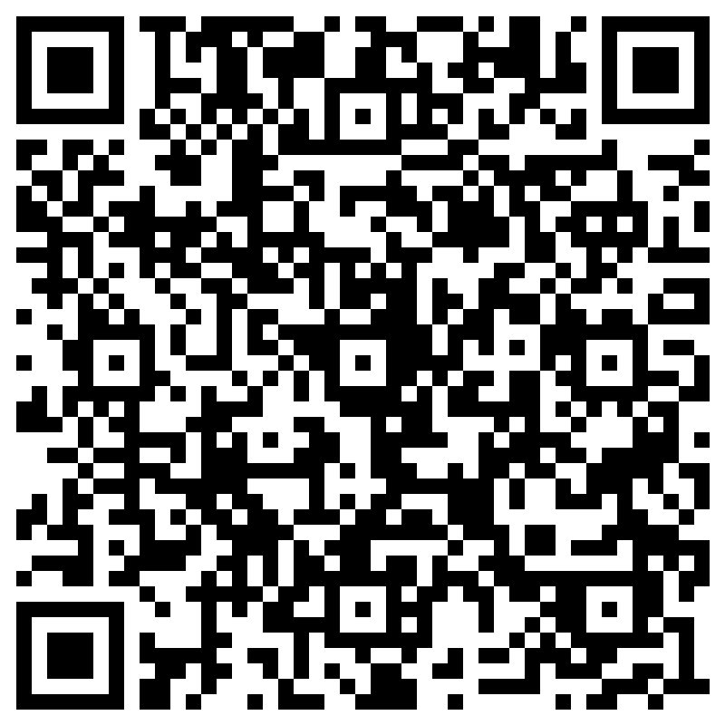

Before we begin please review the information sheet and complete the consent form. 

This can be accessed via the QR code, or via the link on the homepage of Haymay:

[https://shorturl.at/f1iLj](https://shorturl.at/f1iLj)

---

# Haymay Activity Overview

## Creating the activity

- 1 person in the group will be the host and 'Create' the activity
- The remaining members of the team will 'join' the activity using the code provided by the host

---

# Haymay Activity Overview

## Completing the activity

1. Match the opinions to the personas by placing them on the correct screen
2. Identify and minimise the neutral opinions
3. Use the opinions to debate the question in your groups
4. Write a structured argument in response to the debate question

---

# Haymay Survey

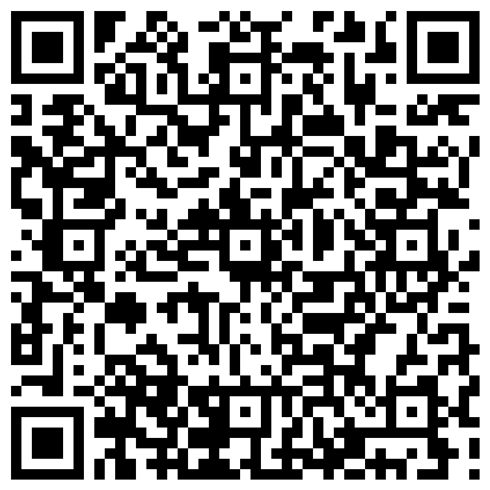

Thank you for taking part in the activity with Haymay. 

Please take time to complete the feedback survey. 

This can be accessed via the QR code, or via the final activity screen on Haymay.

---

<!-- _class: question -->

# Are you pro AI or Anti-AI?

## Menti: xxxxx

---
<!-- _class: main -->

# Thank You!

j.hobbs@bathspa.ac.uk