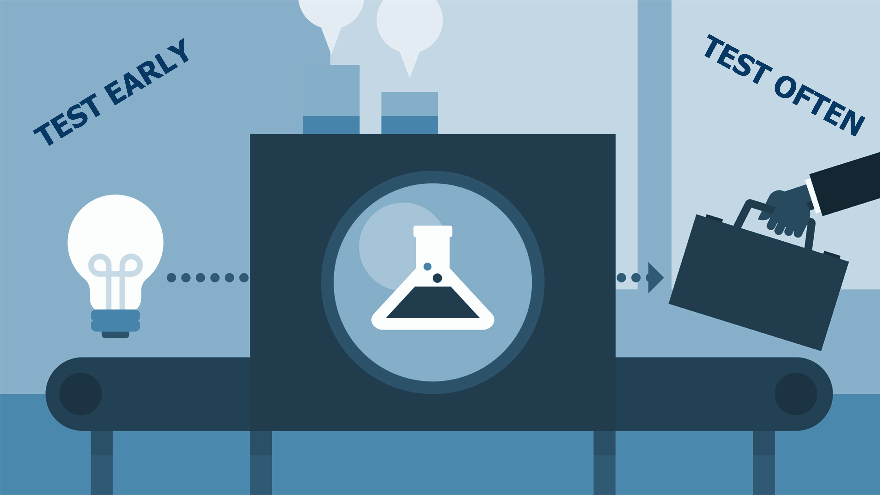
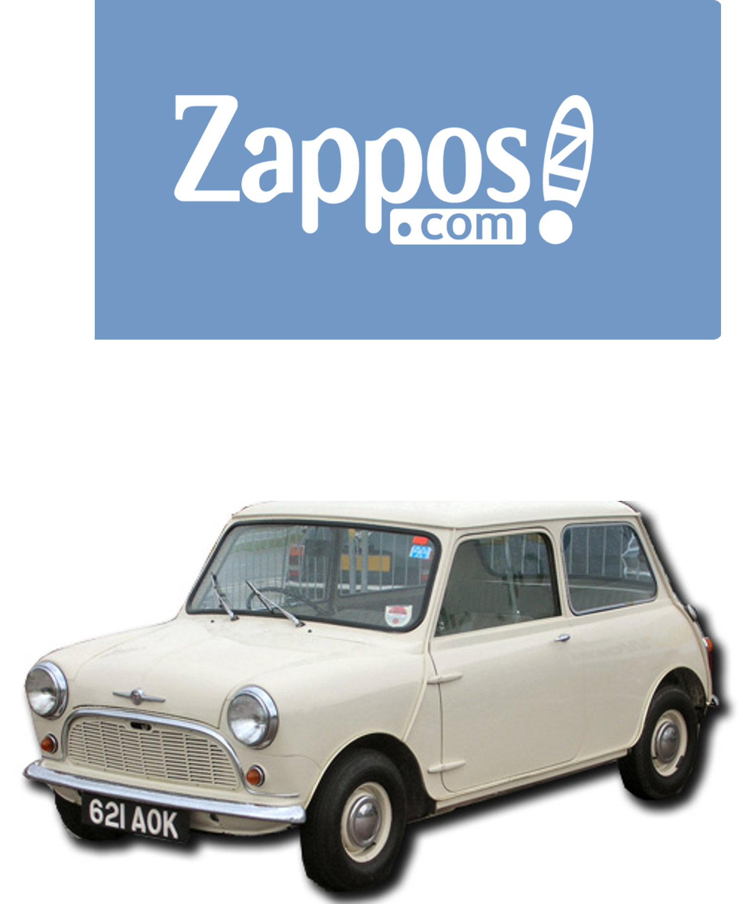
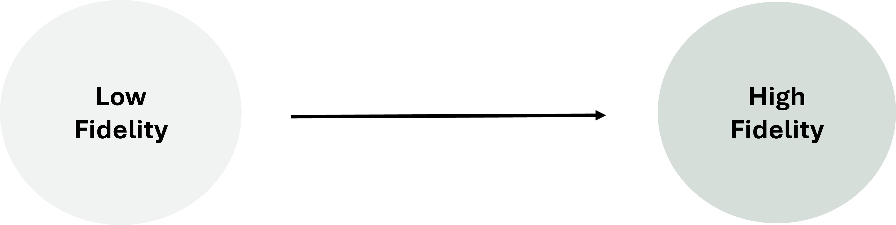
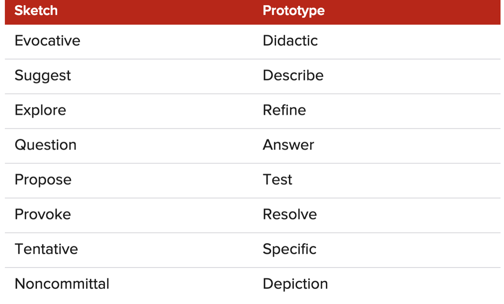
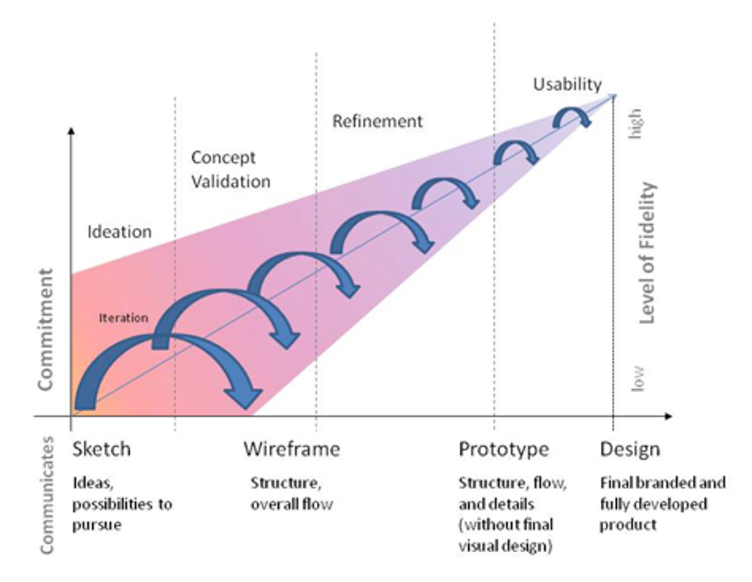
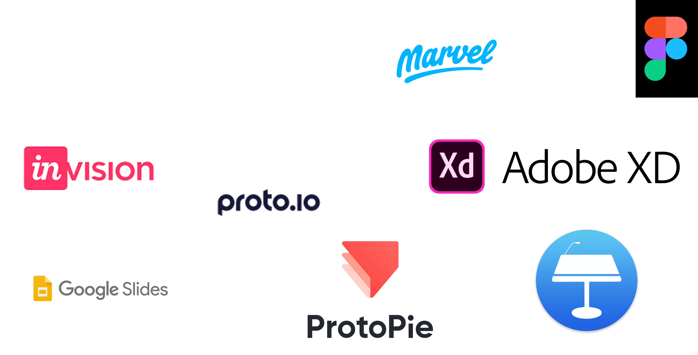
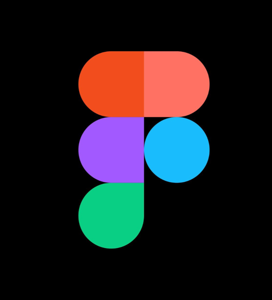
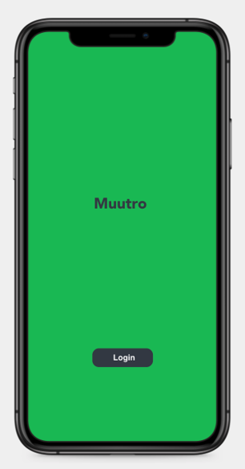

<!-- _class: main -->
# Prototyping

<j.hobbs@bathspa.ac.uk>

---

# Objectives

- Understand the importance of prototyping early and often
- Learn the difference between low and high-fidelity prototypes
- Introduce the basics of Figma for prototyping

---
<!-- _class: lead -->

# 1. Prototyping

---

# What is a Prototype?

Prototypes are early, scaled down versions of a product that allow designers to bring their ideas to life, gain feedback from prospective users or clients and work towards identifying the right solution.

<!--
So we have a concept or problem statement, and we have ideas that might solve it – how do we test these ideas? This is where prototypes come in. The prototyping phase allows us to take our ideas forward and refine it towards a solution.

Prototypes allow designers to bring ideas to life and test the practicality of these ideas through testing and feedback from prospective users and clients. 

Prototyping follows on from the ideation phase where you may have 2-3 ideas in contention to be the final solution. By prototyping these ideas you can fail quickly and cheaply and therefore prevent wasting money on a bad idea. As stated by Tim Brown from the design & innovation firm IDEO prototypes:

“Slow us down to speed us up. By taking the time to prototype our ideas, we avoid costly mistakes such as becoming too complex too early and sticking with a weak idea for too long”

It would be pointless to fully develop the 2-3 ideas you may still be considering from an ideation process, especially as only one will become the right solution. Yet it also would not make sense to only take one idea forward from ideation and fully develop this idea as it may end up not fulfilling the user needs. Prototyping provides a cost effective means to whittle down and refine potential ideas and move you towards the best solution. 

By placing prototypes in front of users you gain an insight into how they behave, think and feel when interacting the product and thus discover whether the prototype is the right solution to fulfil their needs. 
-->
---

# Prototyping enables exploration

 

*“Prototyping is the conversation you have with your ideas”*

**Tom Wujec, Designer**

<!--
Prototyping allows you to explore your ideas in detail and gain a deeper understanding of how they will work. Ideation generates the ideas, prototyping sense checks them

-->
---

<!--
Prototyping allows you to test early and test often, which is important in the experience design process. Studies by the Nielsen Norman Group  have shown that the biggest improvements to user experience come from testing as early as possible. It is also much cheaper to make design and feature changes before any code implementation has begun (estimates state early changes are 100 times cheaper than changes after code has been implemented) and early testing will uncover the need for such changes. 

Prototyping also links into the the Fail Fast approach of agile development, as when combined with early testing it allows you to quickly learn from mistakes and get rid of design elements that users do not like. Failure is an accepted component of experience design and is how you learn from mistakes and develop designs that truly satisfy users. And if you take the view of Thomas Edison you may feel that failure does not exist as he is quoted as saying:

“I have not failed, I’ve just found 10,000 ways that won’t work”
-->

---
# Minimum Viable Product

A product with just enough features to satisfy early users and inform future product development. 

New features and functionality are added based on feedback from these early users. 

<!--
Prototyping feeds into the idea of the minimum viable product…

A minimum viable product is a product with just enough features to satisfy early users and inform future product development. Based on feedback from users new features and functionality are added through iterative cycles that seek to make constant small improvements to the product. In digital products where the platforms of delivery enable easy iteration through seamless updates focusing first on the MVP is becoming increasingly common and are the central tenant of development methodologies such as lean, which constantly seeks to output the minimum viable product, or minimum viable update after each iteration.

Whilst the product may have wider goals in the long term, focusing first on a Minimum Viable Product with a small subset (or core) product goals you bring in valuable user feedback early and see if the product has traction in the first place. Ultimately this will save costs, because if you find that know one actually likes the product, or there are major flaws in the solution have haven’t wasted years developing the product with all the possible features.

With your assessments your minimum viable product will be in the form of your high fidelity prototype. From this you can convey the idea for your product to the audience, gain feedback that could be used in the next iteration of the product where you might move it into development. You could see your high-fidelity prototype as the MVP before the MVP or a Pre-MVP. 

Car example: wheel → skateboard → go kart → car

Zappos example
-->
---
# Prototyping Methods

<!--
There are a range of different prototyping methods that you can use that sit on a range between low (quick & rough) to high (detailed and realistic) fidelity. 
-->

---
# Low Fidelity

Basic version of the product that may only focus on a few features, or lack finesse in terms of design and detail.

Examples include:
- Sketches
- Storyboarding
- Wireframes
- Paper Prototypes

<!--
Low Fidelity = basic sketched out versions of the product - enough to convey an idea but lacks detail or any finer consideration of design

One of the biggest benefits of low fidelity prototypes is they are quick and inexpensive to produce, which in turn means making changes are quick and can be drawn up in a matter of minutes and therefore various iterations may be tested in the same session. The fact that low fidelity prototypes often just require pens and paper means there are low barriers to entry and anyone can get involved in producing them without need for specialist skills or resources. 

The lack of finesse also means you can gain a broad overall view and impression of the product concept as a whole without people getting bogged down in finer details.

Obviously the lack of finesse does have drawbacks as the prototype will lack realism and any interaction will only be basic and will not fully represent the real user experience or may not fully convey the concept. However the early feedback they do afford is vital in order to shape subsequent higher fidelity prototypes.

-->
---
# High Fidelity

Versions that look and feel closer to the real product. High fidelity prototypes offer greater realism and finesse than low fidelity counterparts.

Examples Include:
- Mockups
- Interactive Mockups
- Early Test Builds

<!--
High Fidelity prototypes will give greater consideration to the design and interaction thus giving the user a greater indication of how the product may look and feel. There are numerous tools that allow you to create interactive prototypes that can mimic what the final product might look like without needing to implement any code, allowing you to fake it until you make it!

As you begin refining prototypes you even may begin to introduce code and carry out some early builds to test the technical feasibility of ideas and designs.

High fidelity prototypes answer the cons of low fidelity prototypes. The enhanced realism in terms of both look and feel can make the usage more engaging and provide a more powerful depiction of the concept to get clients and users on board. This in turn increases the validity of user testing as the user feedback and behaviour is influenced by something that will be very close to the final product. 

However, despite these pros High Fidelity prototypes are more resource intensive to produce. The finesse of the design may also cause users to focus too much of aesthetic or superficial design aspects rather than functional aspects (wants over needs). Due to the resource intensive nature and the time spent in creating the design you there is also the danger of getting too attached to certain design elements and not want to get rid of them despite user feedback. Changes are also harder to implement in comparison to low-fidelity prototypes that can be altered in minutes. The realism of high-fidelity prototypes may also give false impressions in relation to the final design (e.g what happens if the prototypes is better than the final version due to feasibility and viability reasons). Therefore you should always start with Low fidelity prototypes and get feedback from them first to ensure you are focusing on the right solutions when the fidelity increases
-->
---
# Purpose of Prototyping

<!--
The sketch to prototype continuum from Bill Buxton’s Sketching User Experiences

As you move iterate through the prototyping phase and move from low to high fidelity versions the purpose begins to change. Bill Buxton in the book Sketching User Experiences (available in the library) proposes the following differences between the purposes of sketches vs prototypes (Buxton in fact argues Sketches are not Prototypes). Sketches enable the exploration of many different concepts and prototypes then refine these towards the best solution via feedback and testing
-->
---

<!--
Tracey Lepore expands on Bill Buxton’s continuum and represents it visually to show the relationship between what the method is trying to communicate, its level of commitment and amount of iteration. From this Lepore argues sketches → wireframes support ideation and concept validation, while wireframes → prototypes (or mockups) support refinement and user testing. This is afforded by the nature of the techniques with sketches and wireframes being more flexible in terms of level of commitment and are thus easier to change and explore different ideas. 

Bill Buxton and Tracey Lepore's continuums show us where different prototyping methods are most suited. Early in the design process when you are still unsure of which solution is the right one you should use low fidelity methods and develop quick and dirty prototypes (e.g. paper). Towards the end of the project is when you should be using high fidelity prototypes as by this point you should know which solution is the right one from low fidelity testing. Therefore the investment in high fidelity techniques is justified as the focus is on refining a single solution.
-->
---

# Fake it before you make it

 

*“It is much easier, cheaper, faster, and more reliable to find a little old man who can create the illusion of wizardry with a microphone and some loud speakers than it is to find a real wizard. Fake it before you actually build it.”*

**Tracey Lepore, Designer**

---
<!-- _class: lead -->
# 2. Figma
---

# Prototyping Tools

<!--
There are a range of tools you can use for High Fidelity Prototyping and there is no restriction on what you opt for in your assessments. I recommend using Figma as this is a popular industry standard tool and the one I will introduce today
-->

---
# What is Figma?

- High Fidelity Prototyping Tool
- Can create fully interactive prototypes with no code
- Dev mode streamline's ability to go from design to code
- Great for collaborative design, sharing ideas and gathering feedback

<!--
Figma is an industry standard design and prototyping tool that allows you to make fully interactive prototypes with no code. It is feature rich including a dev mode that streamlines the ability to go from design to code, making it a great tool for collaboration between designers and devs. 
-->
---

---

# Get Figma

Go to **[https://www.figma.com/education/](https://www.figma.com/education/)** to get verified.

An educational account gives you access to all premium features.

**5mins**

---

# Figma Fundamentals

- Interface Orientation
- Creating Frames
- Creating & Importing graphics
- Creating components & variants
- Basic prototype interactions
- Creating Overlays
- Creating Scrolling Elements

<!--
Today's session will introduce the following in Figma
-->
---

# Figma Resources

Video demos of everything covered can be accessed at the link below, including a tutorial on how the Muutro demo was made:

[Video Demos](https://loom.com/share/folder/9e8f68395f904bdcae0cecb194f6f2cd)

Other useful resources include:

- [Figma for Beginners](https://help.figma.com/hc/en-us/sections/4405269443991-Figma-for-Beginners-tutorial-4-parts)
- [Figma Crash Course](https://www.youtube.com/watch?v=1SNZRCVNizg)
- [Figma YouTube Channel](https://www.youtube.com/@Figma)

---

<!-- _class: main -->

# Thank You

j.hobbs@bathspa.ac.uk

